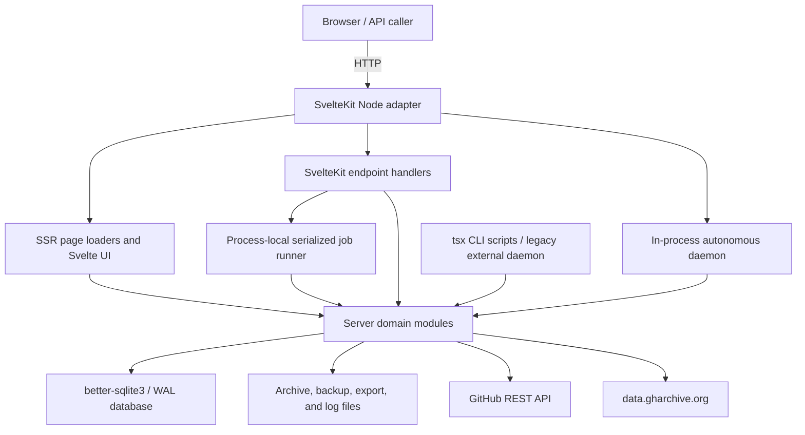

# Architecture and runtime topology

## Architectural style

GithubArchive+ is a SvelteKit 2 / Svelte 5 monolith built with `@sveltejs/adapter-node`. One Node process serves SSR pages, JSON/file endpoints, operator actions, and—when enabled—the autonomous background worker. It uses `better-sqlite3` synchronously and stores archive artifacts on the local filesystem. There is no separate frontend deployment, backend service, database server, message broker, cache server, object store, or identity provider.

The production Docker image runs Node 20 on Debian Bookworm Slim. Railway supplies persistent `/data` paths for the database, archives, backups, job logs, and exports if a persistent volume is attached by the operator; the repository itself does not declare a Railway volume.

## Runtime components

## Request lifecycle

`src/hooks.server.ts` runs on each request. On the first request in a process it calls `ensureBackgroundWorker()`. The worker starts when `BACKGROUND_WORKER=true`, or in `auto` mode when Railway environment variables exist. The hook also returns a quiet cacheable 404 for common scanner paths and `/en/*` or `/es/*`; every other request proceeds directly to SvelteKit resolution.

There is no request middleware for authentication, authorization, session loading, CSRF, API quotas, correlation IDs, structured access logs, security headers, or request timing. This absence applies equally to `/admin/*` and `/api/admin/*`.

Page loaders and endpoints import server modules directly. Database queries are synchronous, so an expensive query, full archive scan, tar decompression, SQLite backup phase, or synchronous file read blocks other work in that Node process.

## Data and storage topology

The configured paths are:

| Data class | Default | Container value | Behavior |
|---|---|---|---|
| SQLite | `./data/githubarchive.db` | `/data/githubarchive.db` | WAL mode; migrations run on DB module initialization / `db:init` |
| Archive files | `./data/archives` | `/data/archives` | Owner/repository timestamped README/tar/ZIP artifacts |
| Backups | `./data/backups` | `/data/backups` | SQLite backup, metadata, archive manifest, optional archive copy and compression |
| Bulk exports | `DATA_DIR/exports` | `/data/exports` | Job-numbered ZIPs; no retention policy |
| Daemon/job logs | `DATA_DIR` | `/data` | Process and worker log/PID/checkpoint files |

SQLite is configured with foreign keys and WAL. The database stores metadata about artifacts but not artifact blobs. A snapshot is valid only when both its database row and resolved file exist. The doctor and storage modules explicitly detect missing rows/files and orphaned files, demonstrating that the database and filesystem can drift.

## Module boundaries

| Boundary | Location | Responsibility |
|---|---|---|
| Web routes | `src/routes` | Page data loading, rendering, JSON/file responses, action dispatch |
| Shared UI | `src/lib/components`, `src/lib/*.ts` | Repository cards, source browser, category labels, evidence and navigation helpers |
| Database repository layer | `src/lib/server/db` | Connection, executable schema/migrations, typed rows, query functions |
| Domain/service layer | `src/lib/server/*.ts` | GitHub/GH Archive clients, enrichment, archive creation, intelligence projections, maintenance |
| Worker layer | `src/lib/server/workers` | Bounded ingest/search/enrich/refresh/archive cycles with job recording |
| Autonomous control | `background-daemon.ts`, `daemon-planner.ts`, `daemon-backlog.ts` | Backlog measurement, action scoring, loop, sleep/backoff, decision logging |
| Manual control | `job-runner.ts`, admin endpoints | One in-process promise queue for operator-triggered work |
| CLI | `scripts` | Database init, ingest, enrichment, archive, backfill, backup/restore, diagnostics, legacy daemon |

The database facade is split between `src/lib/server/db/*` and a large presentation/domain projection module, `src/lib/server/repos.ts`. The latter aggregates repository detail, readmes, evidence, scores, related results, timeline, links, and archive URLs; at 1,477 lines it is a major coupling point.

## External integrations

### GH Archive

- Base: `https://data.gharchive.org`.
- Resource: hourly `{yyyy-mm-dd-h}.json.gz` files.
- Processing: streaming HTTP body → gzip decompression → newline JSON parsing → repository `CreateEvent` matcher.
- Failures: recent unpublished 404 hours are excluded during a configurable grace/cooldown; retry logic is in the CLI ingest core and worker flow.
- Data trust: malformed lines are skipped; terminal stream/gzip errors fail the hour.

### GitHub REST API

- Base: `https://api.github.com`.
- User agent: `GithubArchivePlus/0.3` (different from package version `0.1.0`).
- Optional bearer token; unauthenticated operation receives GitHub's lower quota.
- Uses repository metadata, README raw media, commits/default branch, releases/assets, tags, repository search, archive tarball URLs, and rate-limit endpoints.
- The client has no shared concurrency governor, conditional requests/ETags, durable response cache, or circuit breaker. Worker delays are the principal rate control.

No other external service is integrated. Website URLs and README images are displayed to users but are not fetched by a preservation worker.

## Authentication and authorization

There is no authentication implementation anywhere in the source tree. Specifically absent are hooks that establish identity, cookies/sessions, OAuth, passwords, API tokens for clients, role checks, admin guards, CSRF tokens, origin validation, or authorization-aware caches.

The following unauthenticated operations change state or expose stored content:

- start/stop daemon;
- run ingest, search, enrich, refresh, archive, pipeline, backup, backfill, doctor, and storage jobs;
- delete orphan, duplicate, old, or ZIP snapshots through maintenance options;
- manually refresh/archive/reanalyze any repository;
- create per-repository and bulk exports;
- download any archive snapshot or completed bulk export;
- inspect all job details, errors, daemon decisions, health, storage, and configuration-derived status.

For an Internet-accessible deployment this is the most critical architectural risk.

## Background work and scheduling

Two daemon implementations coexist:

1. `src/lib/server/background-daemon.ts` is the active in-process autonomous planner used by the web app. It measures backlogs and selects one action per loop.
2. `scripts/daemon.ts` is a legacy external linear loop that runs ingest → enrich → refresh → archive. Its behavior and unavailable-hour handling differ from the planner.

Manual admin work uses a module-level promise chain in `job-runner.ts`. It prevents two manual jobs in the same process from overlapping, but it is not a durable queue and does not coordinate with the autonomous daemon, CLI processes, or another application replica. A process restart loses queued intent while leaving `job_runs` rows to later orphan reconciliation.

There is no cron scheduler. Daemon sleep, backlog checks, and first-request boot form the scheduler. If no request ever reaches a newly started non-Railway instance, automatic work does not start unless explicitly configured or the CLI daemon is run.

## Caching

Caching is limited and process-local:

- Repository detail SSR sets `Cache-Control: private, max-age=60, stale-while-revalidate=300`.
- Trend snapshots use module-level `Map` caches with roughly five- and ten-minute TTLs; there is no eviction policy beyond replacement of fixed keys.
- Source archive analysis and tar indexes use module-level maps without TTL or size limits.
- Probe 404s cache publicly for one day; robots/sitemap cache for one hour; snapshot downloads cache privately for one hour.
- Most HTML pages, admin status, list/search APIs, and database projections are recomputed per request.

There is no Redis, shared cache, CDN declaration, HTTP validation via ETag/Last-Modified, or GitHub conditional-fetch cache.

## Error handling and observability

Workers record start/finish status, JSON detail, error string, reason, and timestamps in `job_runs`. The daemon records decisions and a text log/checkpoint. Repository lifecycle events capture selected failures and changes. Admin pages expose recent errors and health checks.

What is absent:

- structured application logging and log levels;
- request/worker correlation IDs;
- metrics, histograms, alerting, tracing, or profiling;
- error reporting service;
- durable retry/dead-letter queues;
- standardized endpoint error envelopes;
- privacy/redaction policy for error strings and job details.

Several GitHub helper functions intentionally swallow non-404 errors for optional data, so rate limits or network faults can be misrepresented as empty releases/tags/README/history rather than observable failures.

## Deployment and scaling model

The repository supports a single Docker container. The design assumes one writer process and local persistent disk. Horizontal replicas would introduce:

- separate process-local daemons and manual queues;
- concurrent SQLite writers and duplicated jobs;
- filesystem visibility problems unless all replicas mount the same volume;
- separate memory event buses and caches;
- competing storage cleanup and backup operations.

Therefore the current safe scaling unit is vertical: one application replica with more CPU, memory, and disk. Before horizontal scale, work ownership must move to a durable queue/lease model, archives to shared object storage or a single writer, and live/cache state to shared infrastructure.

## Architectural invariants and violations

| Claimed or intended invariant | Current reality |
|---|---|
| Evidence-first / append-only history | History tables append, but current rows update, FTS replaces, status tables upsert, and maintenance can delete snapshot evidence |
| A repository can be reconstructed at any point | Only license/topics/head/existence have an `as_of` resolver; source/README/metrics/releases and full metadata do not |
| Autonomous collection | Works on one process, but is booted by a request and lacks durable ownership |
| Preserved artifacts are downloadable | Usually true if files remain; database/file drift is possible and explicitly checked by doctor |
| Build success signals type safety | False: Vite build succeeds while `tsc` reports 32 errors |
