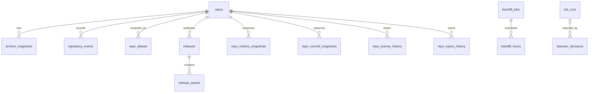

# Database, tables, and migrations

## Engine and measured fixture

GithubArchive+ uses SQLite through synchronous `better-sqlite3`. The executable schema is defined by ordered migrations in `src/lib/server/db/schema.ts`; `CURRENT_SCHEMA_VERSION` is 13. Foreign keys and WAL mode are enabled by the connection module.

The local database was inspected read-only on 2026-08-01:

| Measurement | Value |
|---|---:|
| Main file | 4,096 bytes |
| WAL file | 964,112 bytes |
| Shared-memory file | 32,768 bytes |
| Logical page count | 72 |
| Page size | 4,096 bytes |
| Logical allocated database | 294,912 bytes |
| Freelist pages | 0 |
| Schema migrations recorded | 13 |
| Domain rows | 0 |

All application-domain tables are empty. FTS internal tables contain only format/configuration records, and `schema_version` contains versions 1–13. This is an initialized fixture, not a production snapshot. Per-table production bytes, growth rates, index selectivity, query latency, and real slow-query rankings cannot be measured from it. The size assessments below are cardinality estimates.

## Relationship model

`repos_fts` is a manually maintained search projection keyed by an unindexed `repo_id`; SQLite does not enforce a foreign key. `ingestion_state`, `search_ingest_stats`, `repo_category_daily`, and `schema_version` are operational or aggregate tables without repository foreign keys.

## Table inventory

The inventory includes application tables, the FTS virtual table and all SQLite-created FTS/internal tables.

### `repos`

**Purpose and source of truth.** One mutable current-state row per discovered repository. It is the canonical repository identity and current GitHub metadata record. `full_name` is the application de-duplication key. Historical tables preserve selected previous values but do not make the entire row reconstructable.

**Columns.** `id INTEGER PK AUTOINCREMENT`; required identity/discovery fields `owner`, `name`, `full_name UNIQUE`, `github_url`, `event_id`, `created_at`, `first_seen_at`; metadata `default_branch`, `description`, `language`, `stars`, `forks`, `watchers`, `license`, `topics` (JSON text), `pushed_at`, `updated_at`, `open_issues`, `size`, `homepage`, `visibility`, `owner_avatar_url`, `owner_type`; processing state `enriched_at`, `last_checked_at`, `deleted_at`, `github_archived INTEGER DEFAULT 0`, `discovery_source TEXT DEFAULT 'gharchive'`; intelligence `summary`, `summary_generated_at`, `category`, `category_confidence`, `classified_at`.

**Indexes.** Automatic unique index on `full_name`; explicit indexes on `first_seen_at` (two semantically duplicate indexes, one added by the original schema and one by migration), `created_at`, `language`, `enriched_at`, `deleted_at`, `last_checked_at`, `owner_type`, `category`, and `classified_at`.

**Relationships.** Parent of snapshots, events, aliases, releases, metrics, commit history, license history, and topics history. Child tables vary between cascade and no-action deletion. The application does not normally delete repository rows.

**Population and estimated size.** 0 local rows. Expected one row per unique current `full_name`; text fields, description, topics JSON, and summary dominate. This is a medium-width table read by almost every page and worker. At millions of repositories it becomes the main index and scan cost even before history growth.

**Query/write patterns.** Insert-or-ignore discovery; update on rename, enrich, refresh, delete detection, archive flag, and intelligence generation; list/filter/sort/paginate; backlog counts; detail lookup by slug/id; related-project scoring; aggregate stats. Year filtering uses `strftime` on timestamps and may not exploit timestamp indexes efficiently.

**Migration history.** Created v1; enrichment and deletion fields v1; `last_checked_at`, issues, size v3/v5; discovery source v4; web/owner fields v8; summary/category fields v11.

**Dual-write/denormalization.** Current metrics coexist with `repo_metrics_snapshots`; current license/topics/default branch coexist with history; metadata is copied into FTS; rename state is copied into aliases; some changes are also appended as events. These writes are not transactional as one uniform unit across every call path.

### `archive_snapshots`

**Purpose and source of truth.** Metadata index for README, source tarball, and ZIP files. The bytes on disk under `ARCHIVE_DIR` are the content source of truth; this row supplies provenance and lookup.

**Columns.** `id PK`, required `repo_id`, `snapshot_type`, `file_path`, `file_size`, `sha256`, `archived_at`, optional `head_sha`, and `capture_reason DEFAULT 'daemon'`.

**Indexes.** `(repo_id, archived_at DESC)`; `(repo_id, snapshot_type, capture_reason, archived_at DESC)`; partial `(repo_id, archived_at DESC) WHERE snapshot_type='zip'`.

**Relationships.** `repo_id → repos.id ON DELETE CASCADE`.

**Population and estimated size.** 0 local rows. Grows per changed README/source capture plus generated export ZIPs. Rows are small, but referenced files dominate total storage. No uniqueness constraint prevents repeated rows for identical hashes.

**Query/write patterns.** Latest/list snapshot by repository/type; download by id; head/hash comparison; source backlog exclusion; storage duplicate/orphan cleanup; evidence and timeline projection. Creation also emits `repository_events`, a deliberate dual record.

**Migration history.** v1 creation; `capture_reason` and capture lookup index v11; ZIP partial index v13.

### `repository_events`

**Purpose.** Append-style lifecycle/event timeline: first seen, metadata/metrics/default branch/license/topics/README changes, snapshot/release discovery, rename/archive/delete, and archive failures.

**Columns.** `id PK`, required `repo_id`, `event_type`, `event_time`, `payload_json DEFAULT '{}'`.

**Indexes.** `(repo_id, event_time DESC)`, `(event_time DESC)`, `(event_type, event_time DESC)`.

**Relationships.** `repo_id → repos.id` with no cascade clause.

**Population/size.** 0 local rows. Unbounded event growth; JSON payload makes size highly variable. Expected multiple rows per repository and potentially one per refresh/archive change.

**Patterns.** Timeline, live birth feed, recent activity, archive failure exclusion, preservation evidence, admin errors. It duplicates selected changes also represented by current/history/snapshot tables. There is no uniqueness/idempotency key.

**Migration.** v1.

### `repo_aliases`

**Purpose.** Preserve old-to-new repository names across GitHub renames.

**Columns.** `id PK`, required `repo_id`, `old_full_name UNIQUE`, `new_full_name`, `renamed_at`.

**Indexes/relations.** Automatic unique old-name index plus explicit `repo_id`; FK to `repos` without cascade.

**Population/size/patterns.** 0 local rows; normally zero or a few narrow rows per renamed repository. Written during refresh rename handling; used for historical identity evidence. The old name is globally unique, so a later unrelated repository reusing that name cannot receive another alias row.

**Migration.** v1.

### `releases`

**Purpose.** First-seen release/tag records for a repository.

**Columns.** `id PK`, `repo_id`, optional `github_release_id`, required `tag`, optional `name`, `published_at`, `body`, `tarball_url`, `zipball_url`, flags `prerelease DEFAULT 0`, `draft DEFAULT 0`, and required `first_seen_at`; unique `(repo_id, tag)`.

**Indexes/relations.** `(repo_id, published_at DESC)`, `(published_at DESC)`; FK to `repos` without cascade; parent of assets.

**Population/size/patterns.** 0 local rows. Up to the fetched top 30 releases/tags per enrichment cycle, but unique tags make growth one row per discovered tag. Release body text dominates. Used on detail, timeline, latest releases, score/evidence. Existing release rows are not refreshed, so changed names/bodies/download links are stale.

**Migration.** v1.

### `release_assets`

**Purpose.** Asset metadata attached to newly inserted GitHub releases.

**Columns.** `id PK`, `release_id`, `github_asset_id`, `name`, `size DEFAULT 0`, `download_count DEFAULT 0`, optional `content_type`, `browser_download_url`; unique `(release_id, github_asset_id)`.

**Indexes/relations.** Automatic unique index; `release_id → releases.id ON DELETE CASCADE`.

**Population/size/patterns.** 0 local rows; zero-to-many assets per release. Assets are inserted only when the parent release is new. Download counts and other mutable asset metadata are never refreshed.

**Migration.** v1.

### `repo_metrics_snapshots`

**Purpose.** Append observed popularity/maintenance counters for trends.

**Columns.** `id PK`, `repo_id`, required integers `stars`, `forks`, `watchers`, `open_issues`, `size`, and `captured_at`.

**Indexes/relations.** `(repo_id, captured_at DESC)`, `(captured_at DESC)`; FK to `repos ON DELETE CASCADE`.

**Population/size/patterns.** 0 local rows. Approximately one row per refresh per repository (default 24-hour eligibility), even when metrics are unchanged. Initial enrichment does not create a baseline, so a repository generally needs later refreshes before a delta exists. This will be one of the largest tables over time: roughly `repository count × retained refreshes`, with no retention or downsampling.

**Queries.** 24-hour `MAX - MIN` trend, project signal, history displays, score evidence, admin totals. Current metrics are dual-written to `repos`.

**Migration.** v3, with idempotent v5 repair/index creation.

### `repo_commit_snapshots`

**Purpose.** Observe default-branch commit head and limited parent/tree/author metadata.

**Columns.** `id PK`, `repo_id`, required `sha`, optional `tree_sha`, `parent_sha`, `committed_at`, `author_name`, `author_email`, required `default_branch`, `observed_at`.

**Indexes/relations.** `(repo_id, observed_at DESC)`, `(repo_id, sha)`; FK cascade.

**Population/size/patterns.** 0 local rows. Appended when the observed head changes. The non-unique SHA index permits duplicate observations after a branch reverts. Author email is personal data stored without a retention/privacy policy. Used by `getRepoState`, timeline and evidence.

**Migration.** v10.

### `repo_license_history`

**Purpose.** Record observed license transitions.

**Columns.** `id PK`, `repo_id`, nullable `license`, `observed_at`.

**Indexes/relations.** `(repo_id, observed_at DESC)`; FK cascade.

**Population/size/patterns.** 0 local rows; normally sparse, change-only. Current value is dual-written to `repos.license`; changes also emit events. Used for as-of state and detail history.

**Migration.** v10.

### `repo_topics_history`

**Purpose.** Record normalized topic-set changes.

**Columns.** `id PK`, `repo_id`, required `topics_json`, optional `added_json`, `removed_json`, `observed_at`.

**Indexes/relations.** `(repo_id, observed_at DESC)`; FK cascade.

**Population/size/patterns.** 0 local rows; change-only but JSON width varies. Reordering/case/whitespace is normalized to avoid false changes. Current topics are dual-written to `repos.topics`, indexed in FTS, and changes emit events.

**Migration.** v10.

### `ingestion_state`

**Purpose.** One mutable checkpoint/result per GH Archive hour.

**Columns.** `hour_key TEXT PK`, required `ingested_at`, counters `events`, `inserted`, `skipped` defaulting to zero, `source DEFAULT 'gharchive'`, optional `unavailable_at`, `http_status`.

**Indexes.** `(ingested_at DESC)` plus primary-key index.

**Population/size/patterns.** 0 local rows. Expected one narrow row per attempted/completed hour, about 8,760 rows/year if retained. Upserted on retries/unavailability. Drives missing-hour backlog, admin stats, planner priorities, and search-fallback decisions.

**Migrations.** v2 creation, v4 source, v12 unavailable/HTTP state.

### `search_ingest_stats`

**Purpose.** Audit each GitHub Search query/shard used for discovery.

**Columns.** `id PK`, `hour_key`, `query`, `shard_depth DEFAULT 0`, optional `shard_minutes`, `total_count`, `incomplete_results`, counters `pages_fetched`, `found`, `inserted`, `skipped`, `source DEFAULT 'github_search'`, `status DEFAULT 'running'`, `started_at`, optional `finished_at`, `error`.

**Indexes.** `(started_at DESC)`, `(hour_key)`, `(status)`.

**Population/size/patterns.** 0 local rows. More than one row per searched hour because overloaded windows recurse into shards. Query and error text dominate. Rows are inserted running then updated finished/failed. Used primarily by admin telemetry; no retention.

**Migration.** v9.

### `job_runs`

**Purpose.** Operational history for worker, daemon child, maintenance, backup, export, and pipeline executions. It is not the job queue.

**Columns.** `id PK`, required `job_type`, `status`, `started_at`, optional `finished_at`, `detail_json DEFAULT '{}'`, `error`, `reason`.

**Indexes.** `(started_at DESC)`, `(job_type, started_at DESC)`, and partial `(reason, started_at DESC) WHERE reason IS NOT NULL`.

**Population/size/patterns.** 0 local rows. At least one row per action; daemon/manual wrappers can create parent and child worker rows for the same logical cycle. JSON/error width varies; unbounded retention. Inserted running, updated on finish; stale running rows older than ten minutes are marked failed on startup reconciliation.

**Relationships.** Optional target of `daemon_decisions.job_run_id`; no foreign key from work records back to jobs.

**Migrations.** v2; `reason` and index v11.

### `daemon_decisions`

**Purpose.** Explain each autonomous planner choice.

**Columns.** `id PK`, `decided_at`, `action`, `reason`, `backlog_json DEFAULT '{}'`, optional `job_run_id` FK to `job_runs`.

**Indexes.** `(decided_at DESC)`.

**Population/size/patterns.** 0 local rows. One row per daemon loop/decision, including idle; potentially large over long uptime. Read by admin decision history and diagnostic summaries. No retention.

**Migration.** v11.

### `backfill_jobs`

**Purpose.** Durable definition and coarse status for a historical date-range backfill.

**Columns.** `id PK`, required `start_date`, `end_date`, `source DEFAULT 'auto'`, `max_hours_per_run DEFAULT 6`, `status DEFAULT 'pending'`, `created_at`, `updated_at`, optional `last_error`.

**Indexes/relations.** No explicit indexes; parent of `backfill_hours`.

**Population/size/patterns.** 0 local rows; few rows expected. Insert once, update status/progress/error, select active/recent. Dates are text and the API does not rigorously validate ordering or format.

**Migration.** v7.

### `backfill_hours`

**Purpose.** Per-hour work ledger within a backfill job.

**Columns.** `id PK`, `job_id`, `hour_key`, `year`, `date`, `status DEFAULT 'pending'`, optional `source`, counters `events_parsed`, `repos_inserted`, optional `error`, and `updated_at`; unique `(job_id, hour_key)`.

**Indexes/relations.** Automatic unique index; `(job_id, status)`, `(date)`; FK `job_id → backfill_jobs.id ON DELETE CASCADE`.

**Population/size/patterns.** 0 local rows. Up to 24 rows per requested day; a full year creates 8,760 rows per job. Inserted as plan, updated as hours execute, queried for next pending work and progress.

**Migration.** v7.

### `repo_category_daily`

**Purpose.** Daily/hour-key category distribution used to identify underrepresented discovery categories.

**Columns.** `id PK`, `observed_at`, `category`, `repo_count`, `pct_of_total`; unique `(observed_at, category)`.

**Indexes.** Automatic unique plus `(observed_at DESC)`.

**Population/size/patterns.** 0 local rows. At most one row per observed category per rollup timestamp. Upserted before search-ingest cycles and read for gap selection. Categories with zero repositories are not inserted, so completely missing categories cannot be selected by the “under 1%” query—a logic blind spot.

**Migration.** v11.

### `schema_version`

**Purpose.** Ordered migration ledger and applied-schema source of truth.

**Columns/indexes.** `version INTEGER PK`, `applied_at`.

**Population/size/patterns.** 13 local rows, negligible growth. Read at startup/doctor; appended after each successful migration. Versions 1–13 were applied within milliseconds on 2026-07-07.

### `repos_fts` and FTS internal tables

**Purpose.** `repos_fts` is an FTS5 virtual table over `full_name`, `owner`, `name`, `description`, `language`, `license`, `topics`, and up to the first 50,000 characters of latest README text; `repo_id` is unindexed metadata. Tokenizer: Porter stemming plus Unicode 6.1.

**Maintenance.** Application code manually deletes and reinserts each repository document after discovery/enrichment/refresh/README capture. Migration v6 initially backfills. There are no SQLite triggers, so missed code paths can drift; doctor compares counts and can rebuild.

**Population.** 0 logical documents locally. SQLite-created tables are:

| Table | Local rows | Internal role |
|---|---:|---|
| `repos_fts_config` | 1 | FTS configuration key/value row |
| `repos_fts_content` | 0 | Stored column content for documents |
| `repos_fts_data` | 2 | Segment/root blocks present even when empty |
| `repos_fts_docsize` | 0 | Per-document token-size data |
| `repos_fts_idx` | 0 | Segment term-to-page index |

These tables are owned by FTS5 and must not be written directly. Their eventual size is driven heavily by README text and token vocabulary; FTS can approach or exceed the size of indexed text plus segment overhead.

### `sqlite_sequence`

SQLite-created AUTOINCREMENT sequence state. It has 0 local rows because no domain AUTOINCREMENT table has received data. It is internal and not queried by application code.

## Migration ledger

| Version | Effective change |
|---:|---|
| 1 | Core repositories, enrichment/current metadata, archive snapshots, events, aliases, releases/assets; includes defensive repair/drop behavior for incompatible early tables |
| 2 | `ingestion_state` and `job_runs` |
| 3 | Repository check/issues/size fields and metrics snapshots |
| 4 | Discovery source on repositories and ingestion |
| 5 | Idempotent repair/index creation for refresh and metrics fields; backfill `last_checked_at` |
| 6 | FTS5 table and initial index population from repositories/README snapshots |
| 7 | Backfill jobs and hours |
| 8 | Homepage, visibility, avatar, and owner type |
| 9 | Search-ingest telemetry |
| 10 | Commit snapshots, license history, and topic history |
| 11 | Autonomous-operations intelligence: job reason, summary/category, capture reason, category rollups, daemon decisions |
| 12 | GH Archive unavailable timestamp and HTTP status |
| 13 | Partial ZIP snapshot index |

`docs/migration011.sql` is a standalone reference for v11, not the migration runner. README still states schema v9 and is stale. Migration v1 contains compatibility logic that can drop malformed/legacy tables; this matters when upgrading unknown pre-v1 databases and should be tested against backups.

## Data integrity and lifecycle observations

- Repository deletion is represented by `deleted_at`; rows are retained. Foreign-key delete behaviors are inconsistent, but normal code avoids deletion.
- Event and history timestamps are ISO text. SQLite has no CHECK constraints validating timestamp, enum, JSON, nonnegative counters, category, source, status, or snapshot type.
- `event_id` is required but not unique. `full_name` controls discovery identity.
- JSON is stored as unchecked text in topics, payloads, job details, backlog, added/removed topic sets.
- No migration checksum or transactional whole-version ledger is documented. Migrations are executable code and rely on idempotent checks.
- There is no database retention, partitioning, metrics downsampling, VACUUM schedule, WAL checkpoint policy in application code, or production backup verification schedule.
- Estimated high-growth tables are `repo_metrics_snapshots`, `repository_events`, `archive_snapshots`, `job_runs`, `daemon_decisions`, `search_ingest_stats`, and FTS internal tables.
- Estimated high-storage system is the archive filesystem, not SQLite. Configured source downloads allow 50 MiB each; ZIP duplication and full backups can multiply disk usage.

## Deprecated, unused, and dual-write table assessment

No current application table is marked deprecated, and static query/reference inspection found active read or write paths for every application-managed table. The FTS internal tables and `sqlite_sequence` are SQLite-managed rather than directly used. Migration v1 contains compatibility cleanup for malformed legacy tables, including an earlier `star_snapshots` shape, but that legacy table is not present in schema v13.

Current intentional duplication/dual-write relationships are:

| Current/projection write | Historical/evidence write | Consistency concern |
|---|---|---|
| `repos` metrics columns | `repo_metrics_snapshots`, sometimes `metrics_updated` event | Initial enrichment lacks snapshot; refresh appends snapshot even unchanged |
| `repos.license` | `repo_license_history` and `license_changed` | Change-only history; current row fallback is needed before first change |
| `repos.topics` | `repo_topics_history` and `topics_changed` | JSON normalization differs from raw/current serialization |
| `repos.default_branch` | `repo_commit_snapshots` and default-branch event | A branch/head observation is not full Git history |
| `repos` rename/current slug | `repo_aliases` and `renamed` event | Global unique old name can conflict with name reuse |
| Repository/README current text | `repos_fts` | Manual delete/reinsert, no trigger |
| Artifact file | `archive_snapshots` and snapshot/readme events | Filesystem and SQLite cannot commit atomically |
| Manual/daemon action state | `job_runs`, daemon decision, process memory/log | One action may create several rows and memory state is not durable |
| Ingest/backfill/search work | `ingestion_state`, `backfill_hours`, `search_ingest_stats`, job detail | Overlapping operational ledgers do not share one work id |
