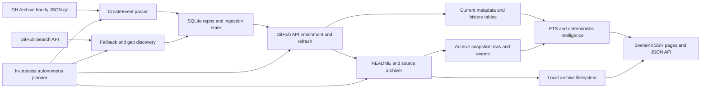

# Product and system overview

## Product purpose

GithubArchive+ is a self-hosted discovery and preservation application for newly created public GitHub repositories. It watches the public GitHub event stream, supplements missed discovery with GitHub Search, enriches discovered repositories through the GitHub API, records metadata history, and stores README and source snapshots on local disk. A SvelteKit website exposes searchable discovery feeds, repository evidence, historical timelines, downloadable archives, and operational controls.

## Current version

The NPM application version is `0.1.0`. The GitHub user-agent string calls itself `0.3`, the executable/current database schema is v13, and roadmap product versions use a different v10–v17 sequence. These identifiers are not synchronized and must not be treated as one release number.

## Long-term vision

The product vision in `docs/ROADMAP.md` is broader: a “software museum” that can explain what a project was, how it changed, why it mattered, and whether it can be reconstructed. The current application is a strong collection-and-browsing prototype, not yet that complete historical knowledge system.

## Intended users

The code and existing documentation imply four audiences:

| Audience | Current value | Current limitation |
|---|---|---|
| Software historians and archivists | First-seen timestamps, metadata changes, README/source captures, releases, commit heads, deleted-repo evidence | Sparse state reconstruction and no immutable content-addressed preservation policy |
| Developers discovering new projects | Search, new-project feed, category/language filters, related projects, source browser | No personalization, collections, ratings, semantic search, or robust recommendation model |
| Project maintainers/researchers | Timeline, metrics history, release history, preservation score, download export | Metrics are coarse; dependency and ecosystem analysis are absent |
| Instance operators | Admin dashboard, daemon control, job history, health checks, backup, storage cleanup, backfill | No authentication, durable queue, multi-instance coordination, observability stack, or safe separation of operator and public surfaces |

## Current feature inventory

### Implemented

- GH Archive hourly ingestion of repository-creation events.
- GitHub Search fallback and sharded discovery for high-volume time windows.
- Repository de-duplication by `full_name` and rename tracking.
- GitHub metadata enrichment, periodic refresh, default-branch head tracking, topics/license history, releases and release assets.
- README, GitHub source tarball, and generated ZIP snapshots with SHA-256 and filesystem paths.
- Append-style events, metrics snapshots, commit snapshots, license history, and topic history.
- SQLite FTS5 search over repository metadata and README text.
- Home discovery feed, birth feed, repository detail, timeline, README comparison UI, archive downloads, and source file browser.
- Deterministic summary/category generation, evidence grouping, preservation score, recoverability score, project signal, simple related-project ranking, and current trend feeds.
- Autonomous in-process planner, manual worker controls, historical backfill, job history, backup/restore tooling, health checks, and storage analysis/cleanup.
- Railway/Docker deployment configuration.

### Partially implemented

- **Historical reconstruction:** `getRepoState(as_of)` resolves repository existence, license, topics, and latest commit head, but not full metadata, metrics, README, releases, dependencies, or source state.
- **Archive intelligence:** source parsing can list files, languages, largest files, security-sensitive names, and technology hints, but its result is not connected to the main detail loader.
- **Metrics/trending:** raw metrics snapshots and a 24-hour `MAX - MIN` trend calculation exist. The velocity, acceleration, percentile, and emerging-project APIs specified in `docs/METRICS.md` do not.
- **Autonomy:** a planner chooses a single next action, but scheduling state is memory-local and work is not coordinated across processes.
- **Append-only preservation:** many historical tables append, but current-state rows and jobs are updated; FTS is replaced; cleanup can delete snapshots; ingestion/category rows use upserts.
- **Web presence:** a homepage field and README links/images are rendered, but no website lifecycle is tracked.

### Planned only

- `repo_files`, `repo_features`, and `repo_dependencies` evidence layers.
- SQL-derived velocity, acceleration, growth percentile, emerging, weekly-gainer, and sleeping-giant feeds.
- Complete evidence explorer/trail, repository milestones, significance narratives, archaeology, ecosystem intelligence, repository memory, and a broader public historical API.
- Covering indexes, incremental FTS, and a database-backed worker queue.

### Absent

- User accounts, login, permissions, API keys, roles, rate limits, and audit attribution.
- Ratings, favorites, saved collections, personal feeds, notifications, comments, and moderation.
- Repository clusters, vector embeddings, semantic similarity, calibrated machine-learning confidence, duplicate-repository detection, and human review queues.
- Website crawling, screenshots, reachability verification, status history, dead-site detection, or domain ownership checks.
- A separate API service, queue service, object store, CDN, analytics platform, error tracker, metrics exporter, distributed tracing, or centralized logs.

## Core product flow

## Source-of-truth boundaries

| Subject | Canonical source in the current implementation | Replicas or derivatives |
|---|---|---|
| Repository identity | `repos.id` and unique `repos.full_name` | Route slugs, FTS row, event payloads, archive paths |
| Current GitHub metadata | Mutable columns on `repos` | Metrics/history/events capture selected changes |
| Historical evidence | History and event tables plus timestamped archive snapshots | Repository detail projections and scores |
| Archived content | Files below `ARCHIVE_DIR` | `archive_snapshots` stores path, size, hash, head, reason |
| Search | `repos` plus latest README snapshot indexed into `repos_fts` | Search snippets and result ordering |
| Job state | `job_runs` is historical; whether a manual job is currently busy is an in-memory promise | PID/log files and daemon status projections |
| Database schema | `src/lib/server/db/schema.ts`, validated by `schema_version` | README and standalone migration SQL are documentation/reference |
| Product roadmap | `docs/ROADMAP.md`, `docs/METRICS.md`, proposal docs | UI labels sometimes imply future functionality already exists |

## Product maturity assessment

The implementation is best described as an operator-oriented single-instance alpha. Its collection loop, schema evolution, archive evidence model, and direct usefulness are credible. Its public-service posture is not yet safe because administrative mutation is exposed without identity controls. Its historical-intelligence claims also run ahead of the implemented evidence model: dependency capture, full state reconstruction, archive refresh cadence, source-analysis integration, calibrated analytics, and website preservation are missing.

## Current limitations and pain points

- Operators cannot safely expose the site without an external access boundary because public and admin traffic share unauthenticated routes.
- The normal build gives a false sense of health: it succeeds while type checking fails and a valid README comparison can crash.
- Archive operators must manually recapture repositories after the first source snapshot; the autonomous backlog will not do it.
- Source browsing exists, but its intelligence output is not wired into the primary evidence/report experience.
- A single process handles serving, scheduling, database work, decompression, archive downloads, exports, backup, and cleanup, making responsiveness and failure isolation fragile.
- An empty bundled database makes local onboarding lightweight but leaves production capacity/latency/growth behavior undocumented and untested.
- Roadmap terminology, schema versions, environment defaults, and old admin entry points have drifted, making it difficult to know which claims are current.
- Core community and website-preservation workflows—identity, collections, favorites, review, crawling, screenshots, and dead-site handling—have no implementation foundation yet.
